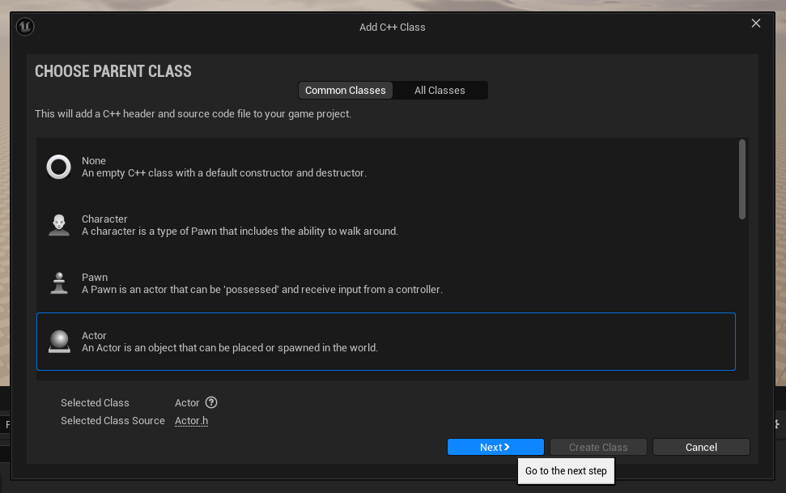

# First steps in UE script
## Message into log

The task is to build a first UE project in UE editor.

The Parent Class for info message will be `Actor` and will be named as: `PrintFavoriteGames`.

Instruction for task:
-  Open UE editor
-  Create the blank project with C++ (not blueprint) preset
-  In `Content Browser` create a new folder and rename it into the name of project. It's better to have good structured project. More info you could find [here](https://github.com/Allar/ue4-style-guide)
-  In created folder make a new folder `Maps` and open it in UE editor
-  Make new folder `Map0`
-  Save Current map in `Map0`
-  Change the preset of map in project to current by: Edit -> Project Settings -> ...
  


- -> Select `Maps & Modes` -> ...


- -> Set `Editor Startup Map` and `Game Default Map` to `Map0`


Now we start to work with scripts and classes:
- Create a new class: `Tools` (for UE v5) -> `New c++ class`


- In Choose Parent Class, select Actor and click the Next button. Change the Name to PrintFavoriteGames. Leave the Path as the default path and click the green Create Class button near the bottom right.



- In IDEin the constructor of class set `PrimaryActorTick.bCanEverTick` variable to `false`. This makes it so the Tick function won’t be called on every frame;  we only need to print our message once when the game starts, not on every frame of the game.
- In function `BeginPlay()` *(the function with the comment that includes Called when the game starts or when spawned above it)* to output the names of your three favorite games:
```C++
UE_LOG(LogTemp, Warning, TEXT("Half-Life"));
```
`UE_LOG()` - is macro, but in that case it is just like a function to us. Make an output message int `Output Log window`
`LogTemp` - log category
`Warning` - is called the verbosity level. It determines how much information is included in the log message and what color it is.
`TEXT("Half-Life")` - provides the text we want to be displayed in the log message.

In the end it will be looks like:


There could be some specific problem with deu to `Live Coding` in UE5. It makes to build a solution in VS harder:


To solve this you should to disable it in UE5, or just press `Ctrl+Alt+F11` in IDE. This is the solution, that I founded [here](https://forums.unrealengine.com/t/ue5-1-vs2022-c-build-error-with-msb3073/694392/2)

How to disable `Live Coding`: in UE editor: Edit-> Editor Preferences -> Live Coding -> Enable to false. Just like on the picture below:


It's important to build solution before you start play the Scene in UE editor.