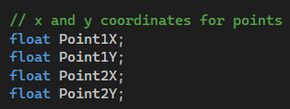

# It's All Greek To Me

In this assignment, you'll calculate the distance between two points and the angle a game character would need to move in to go from the second point to the first point.

There are lots of times in game development where we need to know the distance between two points. For example, an NPC might determine which target to go after based on which one is closest to the NPC. What about angle? For the same example, the NPC needs to figure out how to move toward the selected target; having the angle lets us build the appropriate velocity vector for the NPC.

## The Pythagorean Theorem

The Pythagorean Theorem tells us how to calculate the length of the hypotenuse of a right triangle. A picture (from Wikipedia) will really help here:

We know that:

$
c^2 = a^2 + b^2
$

So if we take the square root of $a^2 + b^2$ we will get c, the length of hypotenuse

## Getting Started

[Here](/Course_1_Introduction/Module_2/1_Distance/source/ProgrammingAssignment2.sln) is materials with Project in VS from the Author.
Mine solution Project in VS is [there](/Course_1_Introduction/Module_2/1_Distance/solution/ProgrammingAssignment2.sln)

## Additional info

There are 4 global variables that we should use in our calculation

The way, we should solve this assignment is clearly illustrated here:

