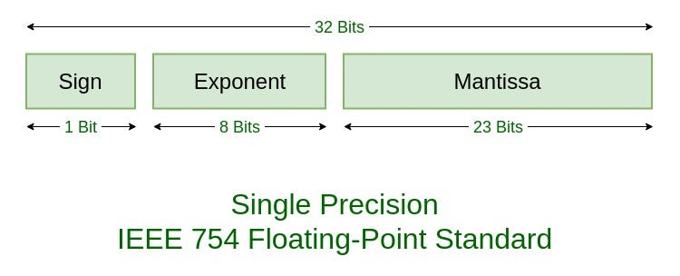
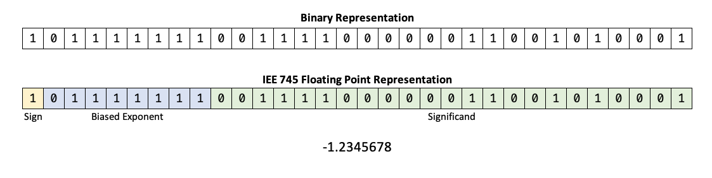

# Data types

## Bits and bytes

Everything in the computer is represented as bits. Bits is 1s and 0s, so binary is base 2. Data type of a variable tells how to interpret the bits. Also, Data type determines the valid operations for the value. The name of variable is some kind of location in memory location of this data. Constants must be set when in declared and can't be changed by program instead the variables can be changed.

### 

### Integer

Table of various data types: 

|**Data type**     |**Memory required in bytes**|**Range**                  |
|------------------|----------------------------|---------------------------|
|short             |2                           |$-2^{15}$  to  $2^{15} - 1$|
|unsigned short    |2                           |$0$  to  $2^{16}-1$        |
|int               |4                           |$-2^{31}$  to  $2^{31} - 1$|
|unsigned int      |4                           |$0$  to  $2^{32} - 1$      |
|long long         |8                           |$-2^{63}$  to  $2^{63} - 1$|
|unsigned long long|8                           |$0$  to  $2^{64} - 1$      |

### Style of variables naming:
- Snake case:
`name_variable_divided_by_underscores`
- Camel case:
`nameVariableProperties`
- Pascal case:
`NameVariableProperties`

### Floating-Point

The floating type can be interpreted as image below:


So the first bit tells only about the sign of value. Next 8 bits tells the amount of number that will be after the dot. And the rest of bits (23) tells the number, that storage here. We can write the formula for this calculation:

$number = (-1)^{sign} * Mantissa * ( 2^{Exponent})$

|**Data type**     |**Memory required in bytes**|**Interpretation**|**Range**                  |
|------------------|----------------------------|------------------|---------------------------|
|float             |4                           |Signed single precision floating point: 23 bits of Mantissa, 8 bits of exponent and 1 bit for sign| $3.4*10^{-38}$  to  $3.4*10^{38}$ positive and negative values|
|double            |8                           |Signed single precision floating point: 52 bits of Mantissa, 11 bits of exponent and 1 bit for sign| $1.7*10^{-308}$  to  $1.7*10^{308}$ positive and negative values        |
|long double       |8                           |Signed single precision floating point: 52 bits of Mantissa, 11 bits of exponent and 1 bit for sign| $1.7*10^{-308}$  to  $1.7*10^{308}$ positive and negative values        |

There is some trick do mentioned:
If we would like to divide two integer numbers, but expecting to get an floating point result, we should use `TypeCast`. It is an instrument in C++ that helps to compiler to understand, that one of variables should be interpreter as different data type. Here is an example of problem:
We have 2 variables `Score = 1360` and `PlayedTime = 10000`. If we execute the code below:
```C++
int main(){
    int Score = 1360;
    int PlayedTime = 10000;

    float PointsPerSecond = Score / PlayedTime;
    std::cout << PointsPerSecond;
} 
```
The output will be:
```C++
0
```
That's happens because of both of variables in calculation is integer. So compiler decided to calculated integer division. But we expected result in floating-point. So we can rewrite code with using tha `TypeCast`:
```C++
int main(){
    int Score = 1360;
    int PlayedTime = 10000;

    float PointsPerSecond = (float)Score / PlayedTime;
    std::cout << PointsPerSecond;
} 
```
The output will be:
```C++
0.136
```

To use the math constant it could be handy to write before libraries include section that:
```c++
#define _USE_MATH_DEFINES
```

After that, you could use, for instance: float `M_PI` as math $\pi$.

[Homework to this module](/Course_1_Introduction/Module_2/1_Distance/Distance.md)