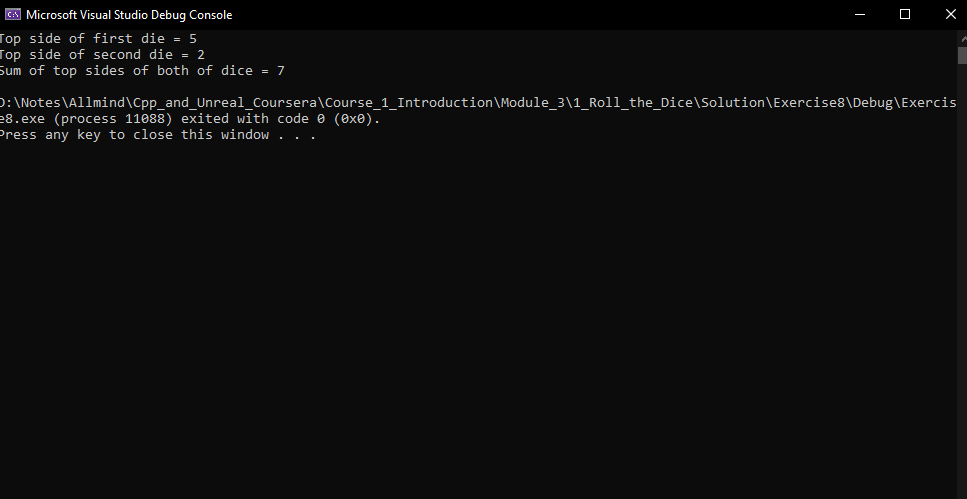

# Exercise 9: 
## Look at the Cards

[Here](/Course_1_Introduction/Module_3/1_Roll_the_Dice/Source/Exercise8/Exercise8.sln) you can find an source-project in Visual Studio Project (*.sln) of this task and [documentation](/Course_1_Introduction/Module_3/1_Roll_the_Dice/Source/Help/index.html) for object, provided by Author. He make this documentation by Doxygen.

### Problem 1 - Create two dice

Declare a Die1 variable and use the appropriate Die constructor to put new six-sided Die object into that variable.

Declare a Die2 variable and use the appropriate Die constructor to put new 20-sided Die object into that variable.

Use the help documentation I provided to figure out which constructor to use.

### Problem 2 - Tell the dice to roll themselves

Tell the Die1 and Die2 variables to roll themselves. Use the help documentation I provided to figure out which function to use.

Side note: The solution I gave you includes a Random class that's initialized in the main function and used by the Die class when a die rolls itself. It's pretty common to have a random number generator that's used by the whole "game".

### Problem 3 - Print the top sides of the two dice and print their sum

Print the top sides of the two dice. Use the help documentation I provided to figure out which function to use.

Print the sum of the top sides of the two dice.

Hint: It's easiest to declare a variable that holds the sum of the top sides of the two dice, then print that sum.

[Here](/Course_1_Introduction/Module_3/1_Roll_the_Dice/Solution/Exercise8/Exercise8.sln) you can find solution for this task in Visual studio Project format (*.sln).

