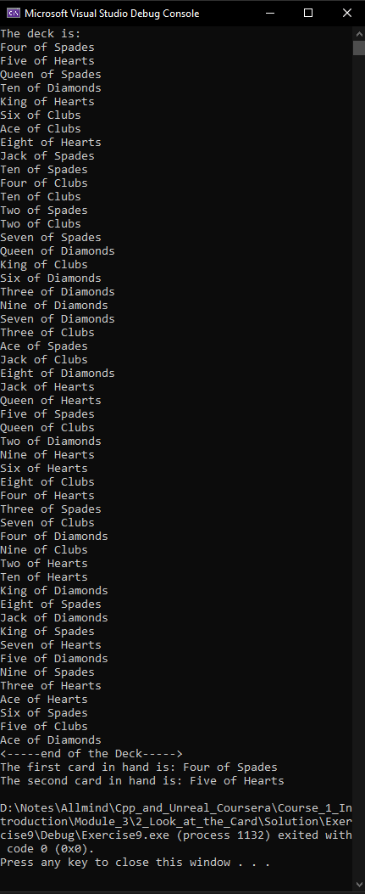

# Exercise 9: 
## Look at the Cards

[Here](/Course_1_Introduction/Module_3/2_Look_at_the_Card/Source/Exercise9/Exercise9.sln) you can find an source-project in Visual Studio Project (*.sln) of this task and [documentation](/Course_1_Introduction/Module_3/2_Look_at_the_Card/Solution/Help/index.html) for object, provided by Author. He make this documentation by Doxygen.

### Problem 1 - Create a deck and tell it to print itself

Declare a Deck variable. Note that doing this automatically calls the Deck constructor to put a new Deck object into the Deck variable.

Tell the Deck to print itself. Use the help documentation I provided to figure out which function to use.

*Note: The deck prints itself from top to bottom, so the first card listed is at the top of the deck.*

### Problem 2 - Tell the deck to shuffle and print itself

Tell the Deck to shuffle itself and print itself. Use the help documentation I provided to figure out which functions to use.

### Problem 3 - Take two cards from the deck and tell them to print themselves

Take a card from the top of the deck and tell it to print itself. Use the help documentation I provided to figure out which Deck function to use to get the top card and which Card function to use to have the card print itself.

Take another card from the top of the deck and tell it to print itself.

*Hint: You haven't called a function that returns a value yet. Here's a good way to do that for this exercise:*

```c++
Card Card0 = Deck.TakeTopCard();
```

The Deck TakeTopCard function returns a Card object. You need to save that object in a variable so you can call its functions.

[Here](/Course_1_Introduction/Module_3/2_Look_at_the_Card/Solution/Exercise9/Exercise9.sln) you can find solution for this task in Visual studio Project format (*.sln).

