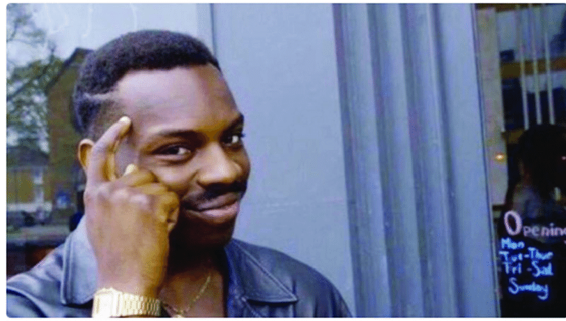
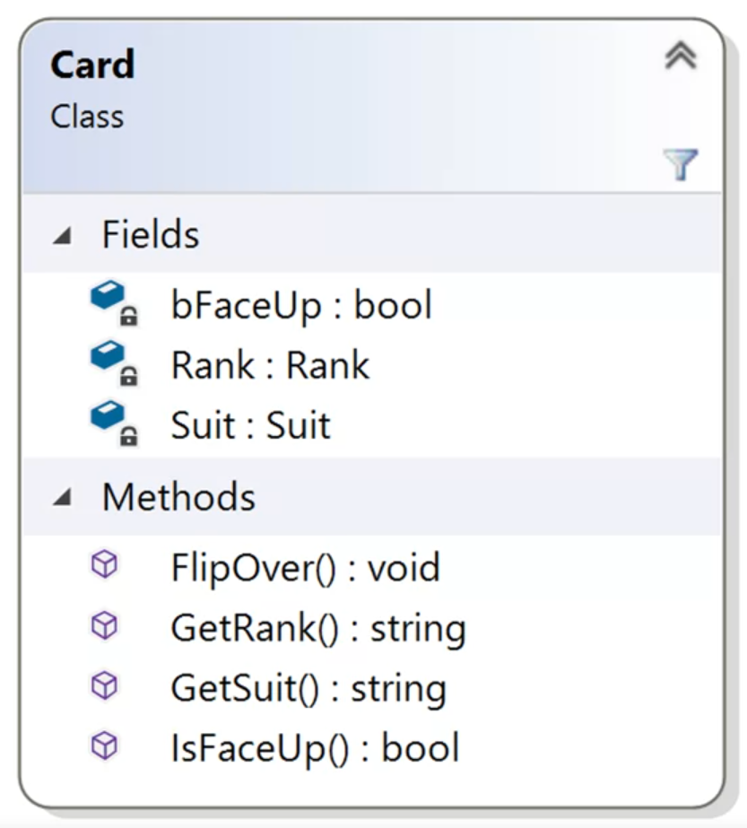

# Classes

The main idea of Object Oriented Paradigm (OOP) is that we can build software as a set of interacting software, entities or objects.
Keyword of this module:

*classes*, *objects*, *state*, "behavior", "identity", "construct", "getters", "setters"

Objects consist of:
- State
  - Characteristics of this object. For instance: Amount of fuel in car
- Behavior
  - What we can do to the object
  - What we can tell the object to do itself
- Identity
  - So we can distinguish one object from another (one car from others car in area)

Let's tru to describe the **Playing Card** as an object:
- **State:**
  - Rank, 
  - Suit, 
  - Face up or not

All this could be stored in some fields in class. But these fields should be private for protection purposes. How can we operate in these fields? We can use Getters and Setters—public methods of class that help us set the fields or get a class field out of this class. 

- Behavior:
  - flip over (change the state of face up to not)
  - Accessed through function

- Identity:
  - When we create a new card object?
  - Memory address 

The OOP stands on **Encapsulation** idea. That means, that object, class or data will no be interfere outside of itself (Outside of it entity). Some kind of shell for data. We put the operation and fields in the same class, that we would like to operate.

Another important idea of OOP information hiding. The fields and the methods of the class can interacts with "outerclass world" only thought some interfaces: getters and setters. This need to secure the data from random event of bad coding. You can't broke it, if you restrict the access to it

Also, if you work out of class, you don't have to know how some methods works. You can just use it.

Class defines the fields, getters and setters, and functions of every object of the class.
Object if actual instance if the class in memory. And each object stores its own state.

To draw the class in block-diagrams you can use UML (Unified Modeling Language). And for object "playing card" in could looks like:

Some extra exercises:
- [Roll the Dice](/Course_1_Introduction/Module_3/1_Roll_the_Dice/Roll_the_Dice.md)
- [Look at the Cards](/Course_1_Introduction/Module_3/2_Look_at_the_Card/Look_at_the_Card.md)-
- [Homework to this module: Nothing Like Blackjack](/Course_1_Introduction/Module_3/3_Nothing_Like_Blackjack/Nothing_Like_Blackjack.md)