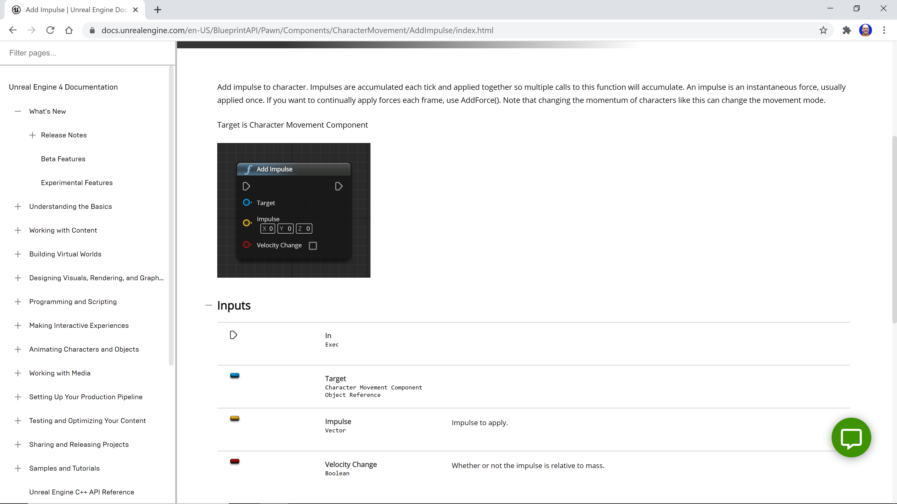
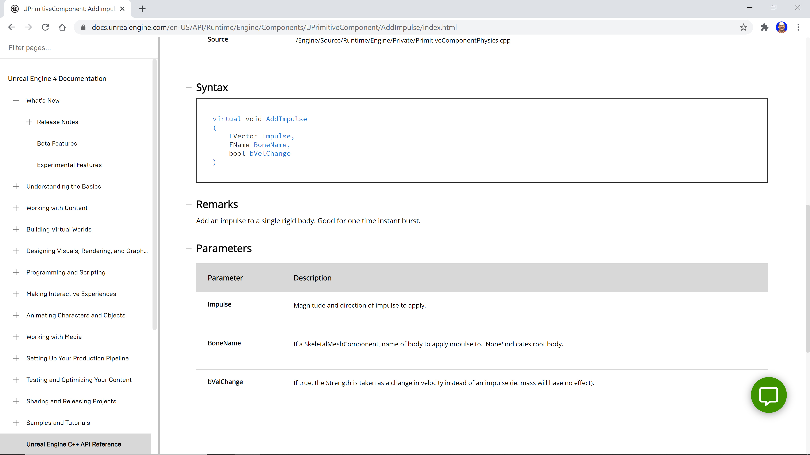

# Exercise 12: 
## Move That Actor

[Here](/Course_1_Introduction/Module_4/1_Move_that_Actor/Source/Exercise12.uproject) you can find an source-project in Unreal Engine editor (*.uproject).

### Problem 1 - Add a blueprint with physics

Import a model of your choosing into the `Exercise12\Art` folder in the `Content Browser` panel. Any of the models I provided in the Week 1 Models reading will work fine, but you can create or download other models if you prefer.

Create a new `Exercise12\Blueprints` folder in the `Content Browser` panel. Navigate to the `Mover` script I provided in the `Content Browser` panel, right click the script, and select Create `Blueprint` class based on `Mover`. Name your blueprint as you see fit, change the Path to save the blueprint in the new Blueprints folder, and click the green Create Class button. Add the static mesh to your blueprint as described in the Chapter 6 reading. 

With the static mesh selected in the `Components` panel on the upper left, scroll down to the `Physics` section in the `Details` panel on the right. Check the `Simulate Physics` checkbox and change the Linear Damping value to 0.

Compile and save your blueprint and close the Blueprint Editor panel.

Navigate to the Blueprints folder in the Content Browser panel and drag and drop an instance of your blueprint onto the map. Change the Location of the resulting Actor to `(0, 0, 0)`.

Note: Strangely, after doing this I had to change the Y Rotation of the the light source to 10, then back to -10, to have it light up the Actor. You may have to do the same.

Run the game. Your mover Actor should fall down out of view. 
`Select Edit > Project Settings... `
from the top menu, scroll down to Physics in the Engine section on the left and click the Physics link. In the Simulation section on the right, change Default Degrees of Freedom to YZPlane. Scroll down to the Constants section and change Default Gravity Z to 0. Close the Project Settings panel.

Run the game again. Your mover Actor should just sit there.

### Problem 2 - Move the Actor

Now it's time to get your mover Actor moving. The Mover script I provided contains code to get access to the static mesh attached to the blueprint; we need a reference to the static mesh because that's what we're going to "push on" to get the Actor moving. The code I provided uses a number of ideas that we haven’t covered yet, but feel free to read
the Getting the Static Mesh reading if you’re interested in how that code works.

Open up the Mover script in your IDE.  You'll be adding code  in the `BeginPlay` function below the comment that says `// add code here to get actor moving`.

To get the actor moving, you want to add an impulse force to the static mesh. How do you know what function to use to do this? Start by searching for “impulse force” (without the quotes) in the Unreal Engine documentation. The top hit is about a Physics example level, but the second hit is called Add Impulse. That looks promising, so you should click that link to get the documentation shown below (we scrolled down a little).



The description tells us this is the function we want to use, but all the information is for the Blueprints visual scripting language, not for C++. Try searching the documentation for “Add Impulse” (without the quotes). The top result is for the page shown in the figure above, but the second result is for `UPrimitiveComponent::AddImpulse`. Whenever you see a search result like this, that’s going to lead to a C++ documentation page (the `::` is a huge hint). Click that result to get the documentation shown below (scrolling down again).



To add the impulse force, you'll call the `AddImpulse` function on the `StaticMesh` variable. When we learned about classes and objects, we learned that we call a function on an object using the dot operator, like `StaticMesh.AddImpulse(<arguments>)`. We need to do things a little differently here, though.  

The `AddImpulse` function is a function we can call on a `UPrimitiveComponent`, and  `UStaticMeshComponent` is a specialized form of `UPrimitiveComponent` (we’ll talk about inheritance later in the Specialization), but `StaticMesh` isn’t  a `UStaticMeshComponent`, it’s a pointer to a `UStaticMeshComponent`. Because StaticMesh holds a pointer to an object, not an object, we need to use `StaticMesh->AddImpulse(<arguments>)` to call the `AddImpulse` function on the `StaticMesh` variable. The -> (called the arrow operator) deferences the pointer, then calls the given function. Whew!

Okay, what should you provide as arguments? The `BoneName` and `bVelChange` parameters have the default values we need (the Visual Studio IntelliSense will show you that as you're typing, but you could also right click on the `AddImpulse` function name after you type it and select Go To Definition as well), so you only need to provide one argument when you call this function. 

We know from the previous exercise that an `FVector` is a struct that has floating-point x, y, and z components. Our argument is the “Magnitude and direction of impulse to apply”, so you should use the `FVector` constructor to create an argument that has `0.0f` force for the x component (we never want to apply any force in the x direction, because that would push our `Actor` out of the y-z plane at `x == 0` ) and some force to push the Actor to the right (the y component) and up (the z component). Go ahead and start at `100.0f` for the y and z components and increase or decrease those values based on how fast your Actor moves when you run the game. Example code that doesn't push the Actor at all is shown below.

```c++
StaticMesh->AddImpulse(FVector(0.0f, 0.0f, 0.0f));
```

Build the project in your IDE, go to the Unreal Editor, and run the game. Your Actor should move up and to the right. Increase the y and z components of your impulse force if the Actor doesn't move at all and decrease those values if the Actor moves faster than you'd like.

### Problem 3 - Play with force

Play around with the values in the `FVector` argument to move your game object in different ways (but always leave the x component at `0.0f`).