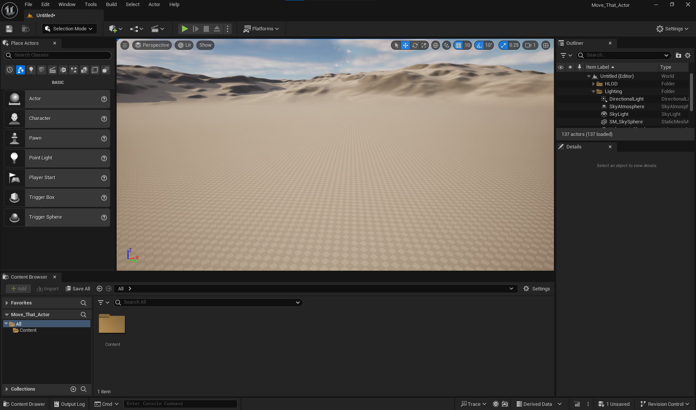
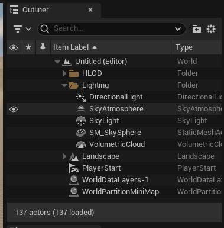
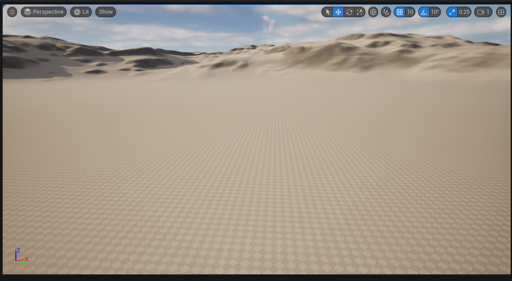
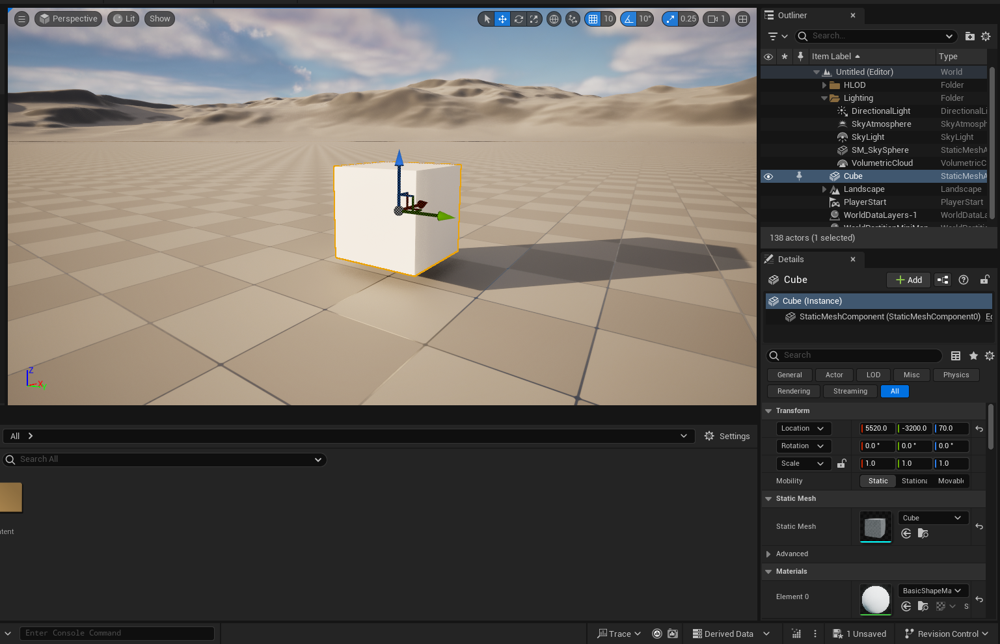
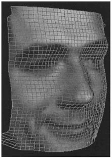

# Unreal Engine Basics

Unfortunately, the lecturer gave poor terminological basics about the game engine and spent much time repeating some information to them. So, I decided to try to fill the knowledge gap by myself. So, there will be a list of necessary determinations:

Here is interface of Unreal Engine 5.4:

On the right side of the screen is item list. This include all entities that existed and places in this map/level. To reduce amount of computation you can delete some of preset stuff such as Atmospheric cloud  or unnecessary stuff:

In the meddle viewpoint: preview of map or level, that you load as a project:

You can add the the Actor to the map by drag and drop from the ContentBrowser or from PlaceActor (left part of the screen)

All thing that you add to you map is an actor also for scripts, that you will add to your world. Every actor has their own set of properties that you can find on the right down side of the screen (below Outliner):

Model is graphical 3D asset that converted by UE to *mesh*, *material(s)*, and *texture(s)*
- Mesh - [here is authors says that](https://link.springer.com/referenceworkentry/10.1007/0-387-30038-4_126) the 3D object representation can be a polygon mesh, which consists of a collection of vertices and polygons that define the shape of an object in 3D. Polygon mesh corresponding to a human face:

- Material - according to [Unreal Engine documentation](https://dev.epicgames.com/documentation/en-us/unreal-engine/unreal-engine-materials) Materials in Unreal Engine define the surface properties of the objects in your scene. In the broadest sense, you can think of a Material as the "paint" that is applied to a mesh to control its visual appearance.

In more technical terms, Materials tell the render engine exactly how a surface should interact with the light in your scene. Materials define every aspect of the surface including color, reflectivity, bumpiness, transparency, and so on. 

- Texture - Textures are primarily used in materials to specify that view of object: the print of it.

Good naming rule is:
- every type of object should be contained in folder with appropriate name. For example: in folder Art should be only different textures, meshes and materials for various object of the scene without any scripts or maps.
- every name of object should start with short name of type of object:
    - SM_NameObj - Static Mesh of NameObject
    - M_NameObj - Material of NameObject
      - T_NameObj_D - diffuse or specular Texture of NameObject
      - T_NameObj_N - texture that specifies a normal map for the mesh

A blueprint is a prefabricated entity—an entity we have configured to behave the way we want it to and then saved as a blueprint. We can spawn several actors that refer to blueprint(or prefab). If you change some properties for the blueprint, all entities will update their properties according to the blueprint.

Some exercises:
- [Move That Actor](/Course_1_Introduction/Module_4/1_Move_that_Actor/Move_that_Actor.md)
- [More Unreal Practice](/Course_1_Introduction/Module_4/2_More_Practice/More_Practice.md)