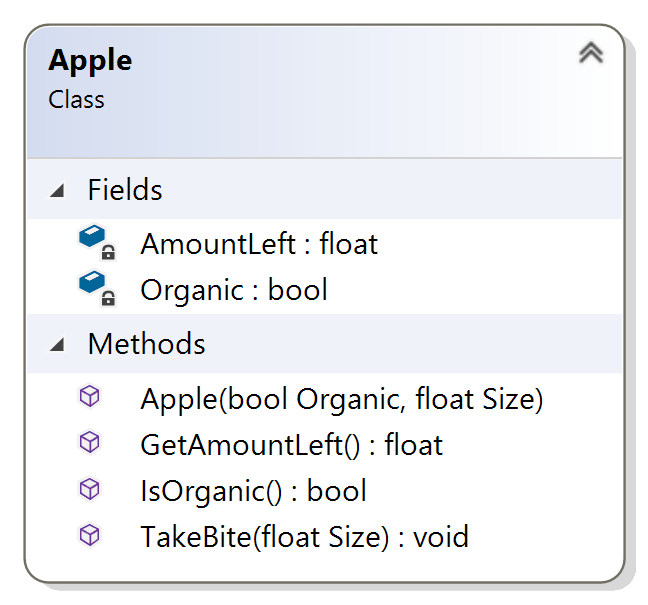

# Exercise 3
## Apple Fields and Getters

### The Problem

Implement the fields and getters for the Apple class from the previous exercise. Here’s the class diagram as a reminder:

You won't be able to test your code until you implement the constructor in the next exercise.

[Here](/Course_3_Class_Development/Module_1/3_Apple_Fields/Solution/AppleExercises.sln) is solution of Visual Studio project for this task (*.sln)