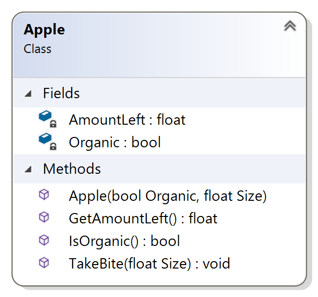

# Exercise 5
## Eating an Apple

### The Problem

Implement the `TakeBite` function for the Apple class from the previous exercises. Here’s the class diagram as a reminder:

Add code to your `main` function to declare a constant bite size, then use a while loop to take bites out of the apple until it’s gone. Print out the amount of the apple that’s left in the body of the while loop. Make sure you never bite more of the apple than is left to eat when you bite the apple in the body of the while loop.

Don’t worry if the initial size of the apple and the bite size you’re using lead to a really small bite before the apple is gone. That’s floating point rounding in action!

[Here](/Course_3_Class_Development/Module_1/5_Eating_an_Apple/Solution/AppleExercises.sln) is solution of Visual Studio project for this task (*.sln)