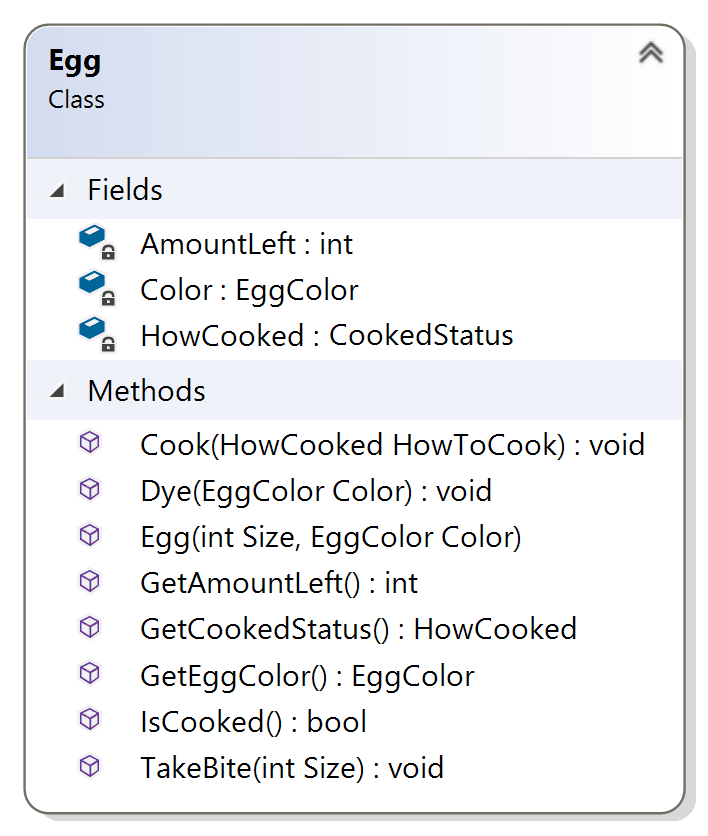

# Programming Assignment
## Nom Nom Nom

### Assignment Description  

Learning about abstraction and developing an `Apple` class (in the exercises) really made you hungry -- but for eggs, not apples.

In this assignment, you'll implement an `Egg` console app class.

### Why do we care?

Because you should get more practice developing constructors, properties, and functions in your own console app class.

### Getting Started

[Here](/Course_3_Class_Development/Module_1/6_Nom_Nom/Source/ProgrammingAssignment1.sln) is source of Visual Studio project for this task (*.sln)

### Requirements

For this assignment, you need to implement an `Egg` class as shown in the class diagram below:

The project I provided to you contains the header and implementation files for the `Egg` class (with the constructor, getters, and function bodies unimplemented) and an implementation file with a `main` function (and supporting functions) that tests the `Egg` class. You shouldn't change the testing implementation file at all (if you do, you'll break the automated grader), all your work in this assignment is in the `Egg.cpp` file.

I've also included two enumerations in the project: one for the color of the egg and one for how the egg is cooked. You shouldn't change those files either.

The constructor should initialize the `AmountLeft` and `Color` fields based on the constructor parameters. The constructor should also initialize the `CookedStatus` field to make the egg uncooked. 

**Hint**: you'll have to use `this->Color` to set the color properly because the field and the parameter are both called `Color`. Don't change the field or parameter name, learn how to use `this->`!

The `GetAmountLeft` getter should return the value of the `AmountLeft` field.

The `GetColor` getter should return the value of the `Color` field.

The `GetCookedStatus` getter should return the value of the `CookedStatus` field.

The `IsCooked` getter should return true if the egg is cooked and false if the egg isn't cooked. You should be able to figure out how to use the value of the `CookedStatus` field to return the appropriate bool from this property..

The `Cook` function changes the `CookedStatus` field using the HowToCook parameter. Once an egg has been cooked, it can't be cooked again.

The `Dye` function changes the `Color` field using the `Color` parameter. Only white eggs can be dyed, and they can only be dyed blue.

**Hint**: you'll have to use `this->Color` to set the color properly because the field and the parameter are both called `Color`. Don't change the field or parameter name, learn how to use `this->`!

The `TakeBite` function changes the `AmountLeft` field based on the `Size` parameter. The value of the `AmountLeft` field should never go below 0.

The best approach is to implement the constructor and the `GetAmountLeft` and `GetColor` getters first (to pass test case 1), then implement the `Cook` function and the `GetCookedStatus` getter (to pass test case 2), and so on.

### Solution
[Here](/Course_2_More_CPP_Programming_and_Unreal/Module_4/5_Give_Me_a_Hand/Solution/ProgrammingAssignment3/ProgrammingAssignment3.sln) is solution of Visual Studio project for this task (*.sln)