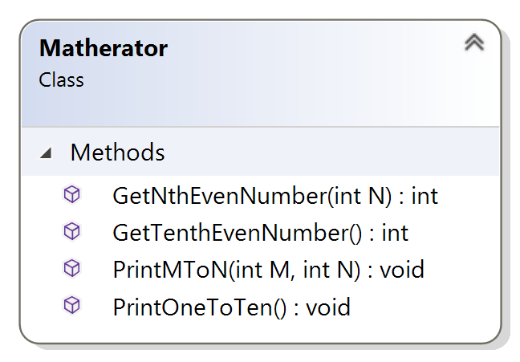

# Programming Assignment
## The Matherator

### Assignment Description

You're really excited about the four different kinds of functions we can have, so you want to implement all of them. Because you also recently learned about console app classes, you also want to put those methods into a separate class.

In this assignment, you'll implement all four kinds of methods in a `Matherator` class.

### Getting Started

[Here](/Course_3_Class_Development/Module_2/2_Matherator/Source/ProgrammingAssignment2.sln) is source of Visual Studio project for this task (*.sln)

### Requirements

For this assignment, you need to implement a `Matherator` class that exposes the functions shown in the class diagram below:



The project I provided to you contains (mostly) blank header and implementation files for the `Matherator` class and a main function that tests the `Matherator` class. You'll need to uncomment the code for each test case in the testing implementation file as you declare the corresponding function in the `Matherator.h` file and implement the function in the `Matherator.cpp` file, but those are the only changes you should make to the testing implementation file (if you change other code in that file, you'll break the automated grader). Almost all your work in this assignment is in the `Matherator.h` and `Matherator.cpp` files.

You've probably noticed that you're developing the four kinds of functions we can have. Remember that you can call one function from another; you should do that as much as possible to avoid duplicating code.

The `GetNthEvenNumber` function gets the nth even number (based on the N parameter) and returns it. This function assumes 2 is the first even number. Note that this function doesn't print that number, it returns it from the method.

The `GetTenthEvenNumber` function gets the tenth even number and returns it. This function assumes 2 is the first even number. Note that this function doesn't print that number, it returns it from the method.

The `PrintMToN` function prints the numbers from m to n, inclusive, based on the M and N parameters.

The `PrintOneToTen` function prints the numbers from 1 to 10.

The best approach is to implement one of the `Matherator` functions, then test it by uncommenting the corresponding test cases in the testing implementation file and running the code, then move on to the next `Matherator` function, and so on. I implemented the functions in the order in which they're tested in the main function.

**Caution**: Make sure you make all your functions public in the header file using the `public:` access specifier.

### Required Output Format

For the two `Matherator` functions that print (rather then return a value), print each value followed by a single space, then add a newline when you've printed all the values. For example, calling the `PrintOneToTen` function should yield the following output:
```
1 2 3 4 5 6 7 8 9 10 
```
**Note: The last value in your output (10 for the example above) must be followed by a single space**. Trust me, it’s easier that way, so the automated grader assumes you do that! The `main` function I provided makes sure your output from calling the functions that return a value is printed in the correct format.

We’d typically label our output to tell the user what those numbers are, but that will just confuse the automated grader. You must print ONLY in the format described above.

### Running Your Code

Because of the code I included to work with the automated grader on Coursera, when you run your program the command prompt window will open and it will sit there doing nothing. To make your code run, type in 3 integers with a single space between each one and press the <Enter> key; your code should then run so you can check your output. 

You'll provide input using the following format:
```C++
<operation> <first argument> <second argument>
```
The first input value tells what operation to perform: 1 for get the nth even number (where n is the value of the first argument), 2 for get the tenth even number (neither argument is used), 3 for print the numbers from m to n (where m is the first argument and n is the second argument), and 4 for print the numbers from 1 to 10.

The second and third input values are the arguments to use when calling the function for the selected operation. Only one of the functions requires both arguments, but it's easier for the automated grader to always process the same input format and just ignore the input values it doesn't need.

For example, your input could be
```
3 2 4
```
to print the numbers from 2 to 4.

You can actually run your code again if you want to by typing in 3 integers with a single space between each one  and pressing the `<Enter>` key again. When you’re ready to stop running your code, type q (for quit).

Here's what running the code multiple times with different inputs should look like. The first line is your input line with the operation and the two arguments, the second line is your output line, and so on: 
```
3 2 4
2 3 4
4 0 0
1 2 3 4 5 6 7 8 9 10 
q
```
**Important Note:** The Coursera formatting makes it look like there's a blank line between each of the lines above, but there's not. The above output should be exactly 5 lines of input/output.

The image below shows my console window when I run the code multiple times as described above:


If your output doesn't match the image above EXACTLY (no extra words, characters, spaces, or blank lines) you'll fail all the test cases in the automated grader. **Remember, even though you can't see it above, each output line has a single space at the end.**

You may have an extra blank line after the q. That's fine. 

### Test Case Inputs

The automated grader uses the following set of test case inputs to test your code (1 test case per line):
```
1 5 0
1 10 0
1 100 0
2 0 0
3 2 4
3 -4 -2
3 1 1
3 -1 0
3 -5 3
4 0 0
```
You should figure out what the expected results are for each test case input and make sure your code is generating those expected results in the required format before submitting your code for grading.