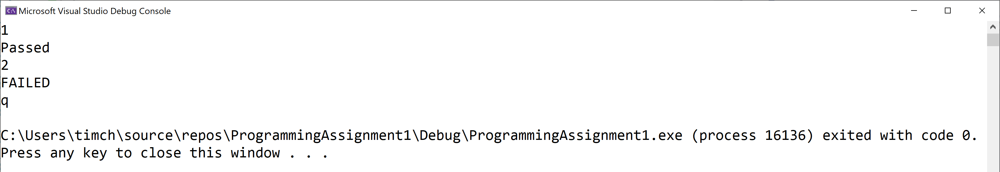

# Programming Assignment
## Getting Rich

### Assignment Description  

In this assignment, you'll implement `MutualFund` and `EmployerSponsoredAccount` console app classes using inheritance.

### Why do we care?

Inheritance and the polymorphism we get "for free" when we use inheritance are incredibly powerful object-oriented features. Almost any non-trivial game you build will include some inheritance. Getting practice with inheritance in this assignment will help you implement more complicated class hierarchies in your games as you need them.
### Getting Started

[Here](/Course_4_OOP_for_Unreal/Module_2/4_Getting_Rich/Source/ProgrammingAssignment1.sln) is source of Visual Studio project for this task (*.sln)

### Requirements

For this assignment, you need to implement the `MutualFund` and `EmployerSponsoredAccount` classes as shown in the class diagram below:


The project I provided to you stubs for the `.h` and `.cpp` files for the `MutualFund` and `EmployerSponsoredAccount` classes, with lots of the functionality waiting for you to implement it. The project I provided also includes fully-implemented `InvestmentAccount` and `SavingsAccount` classes, as well as an implementation file with a main function (and supporting functions) that tests the `MutualFund` and `EmployerSponsoredAccount` classes. You need to make minor modifications to a number of the files I provided to you as indicated in the comments in those files; I had to comment out some code so that the project I provided you in the zip file compiles. The bulk of your work in this assignment is in the `MutualFund` and `EmployerSponsoredAccount` `.h` and `.cpp` files, though.

### How Are Children Different From Their Parents?
#### InvestmentAccount
- The constructor uses the initial deposit to set the `Balance` field
- The `GetBalance` function gets the balance in the account
- The `GetString` function (a pure virtual function) isn't implemented
- The `AddMoney` function adds the given amount to the balance (with error checking)
- The `UpdateBalance` function (a pure virtual function) isn't implemented
- The `SetBalance` function sets the balance to the given amount (with error checking)

#### SavingsAccount
- The constructor uses the initial deposit to set the `Balance` field (by calling the - `InvestmentAccount` constructor) and uses the provided interest rate to initialize the `InterestRate` field
- The `UpdateBalance` function accrues interest using the `InterestRate` field
- The `GetString` function provides the account balance with an account type caption

#### MutualFund
- The constructor uses the initial deposit to set the `Balance` field (by calling the `InvestmentAccount` constructor)
- The `AddMoney` function deducts a service charge using the ServiceChargePercent constant before calling the `InvestmentAccount` AddMoney function to change the balance
- The `UpdateBalance` function updates the balance (by calling the `InvestmentAccount` SetBalance function) by adding 6% to the balance
- The `GetString` function provides the account balance with an account type caption

#### EmployerSponsoredAccount
- The constructor uses the initial deposit to set the `Balance` field (by calling the MutualFund constructor)
- The `AddMoney` function doubles the money being added before adjusting the balance (by calling the `MutualFund` `AddMoney` function)
- The `GetString` function provides the account balance with an account type caption

### Helpful Hint

Child classes can call functions in their parent using the name of the parent class followed by `::` and the function name (including any required arguments). You should do that as much as possible in your solution. Specifically, if you ever find yourself getting ready to copy code from the parent class and paste it into the child class, there's almost definitely a better way to do what you want. Try to figure the better way out before resorting to copying and pasting.

### Required Output Format

The tester implementation file I provided handles all the output correctly. It simply prints Passed or FAILED for each test case that's selected by the user input.

### Running Your Code

Because of the code I included to work with the automated grader on Coursera, when you run your program the command prompt window will open and it will sit there doing nothing. To make your code run, type in a test case number (1 through 10, inclusive) and press the `<Enter>` key; your code should then run so you can check your output. 

For example, your input could be
```
3
```
to run the third test case.

You can actually run your code again if you want to by typing in a test case number and pressing the `<Enter>` key again. When you’re ready to stop running your code, type q (for quit).

**Note:** Don't try to run the same test case twice; it won't work.

Here's what running the code multiple times with different inputs should look like (though none of your test cases should fail!). The first line is the test case number, the second line is your output line, and so on:  
```
1
Passed
2
FAILED
q
```
The image below shows my console window when I run the code multiple times as described above:



### Solution
[Here](/Course_4_OOP_for_Unreal/Module_2/4_Getting_Rich/Solution/ProgrammingAssignment1.sln) is solution of Visual Studio project for this task (*.sln)