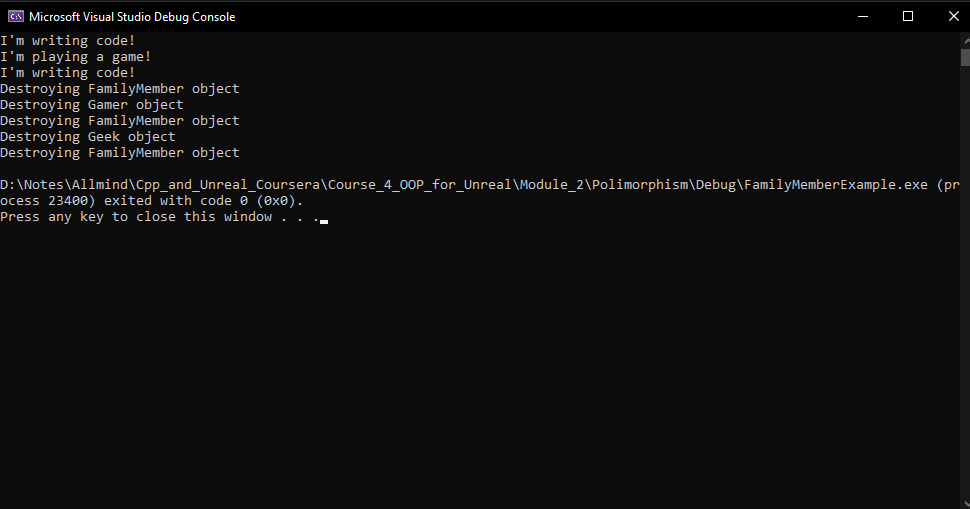

# Module 2. Inheritance and Polymorphism.

## Inheritance
Inheritance is a way to structure code so multiple classes can share standard fields and methods if they are similar. For instance:
We have the parent class, "Car", which describes a car; we can build on this class with another class, the "Dragster", with a small addition. So, class Dragster will have some specific methods and fields, but our code will become clear. Here is the example in UML:


Let's look at another example of Inheritance in case of "Family members" classes. here is the description in UML diagram:


In this case we have a parent class `Family member` and 2 children: `Gamer` and `Geek`. [Here](/Course_4_OOP_for_Unreal/Module_2/Inheritance/FamilyMemberExample/FamilyMember.h) is code if header file of `Family member` class:
```C++
#pragma once

/**
 * A family member
*/
class FamilyMember{
private:
	int Height;
	int Weight;
public:
	/**
	 * Constructor
	 * @param Height height of family member
	 * @param Weight weight of family member
	*/
	FamilyMember(int Height, int Weight);
	/**
	 * Destructor
	*/
	virtual ~FamilyMember();
	/**
	 * Gets the height of family member
	 * @return height of family member
	*/
	int GetHeight();
	/**
	 * Sets the height of family member
	 * @param Height height of family member 
	*/
	void SetHeight(int Height);
	/**
	 * Gets the weight of family member
	 * @return weight of family member
	*/
	int GetWeight();
	/**
	 * Sets the weight of family member
	 * @param Weight weight of family member
	*/
	void SetWeight(int Weight);
	/**
	 * Makes the family member have fun
	*/
	virtual void HaveFun();
};
```

Special word `virtual` means that children (sub-classes) of this class can `override`(replace) this method or (de)constructor with custom behavior. Yup, we can you the same name of methods in children to make the code clear. By the way it connected to Polymorphism, and we are going to talk about it later.
[Here](/Course_4_OOP_for_Unreal/Module_2/Inheritance/FamilyMemberExample/FamilyMember.cpp) is the implementation file of the class:
```C++
#include <iostream>
#include "FamilyMember.h"
/**
 * Constructor
 * @param Height height of family member
 * @param Weight weight of family member
*/
FamilyMember::FamilyMember(int Height, int Weight) : Height{ Height }, Weight{ Weight }
{
}
/**
 * Destructor
*/
FamilyMember::~FamilyMember(){

}
/**
 * Gets the height of family member
 * @return height of family member
*/
int FamilyMember::GetHeight(){
	return Height;
}
/**
 * Sets the height of family member
 * @param Height height of family member
*/
void FamilyMember::SetHeight(int Height){
	this->Height = Height;
}
/**
 * Gets the weight of family member
 * @return weight of family member
*/
int FamilyMember::GetWeight(){
	return Weight;
}
/**
 * Sets the weight of family member
 * @param Weight weight of family member
*/
void FamilyMember::SetWeight(int Weight){
	this->Weight = Weight;
}
/**
 * Makes the family member have fun
*/
void FamilyMember::HaveFun(){
	std::cout << "I'm writing code!\n";
}
```

Now, [let's look](/Course_4_OOP_for_Unreal/Module_2/Inheritance/FamilyMemberExample/Gamer.h) at the `Gamer` class:
```C++
#pragma once
#include "FamilyMember.h"
/**
 * A gamer
*/
class Gamer : public FamilyMember{
public:
	/**
	 * Constructor
	 * @param Height height of gamer
	 * @param Weight weight of gamer
	*/
	Gamer(int Height, int Weight);
	/**
	 * Destructor
	*/
	virtual ~Gamer();
	/**
	 * Makes the gamer have fun
	*/
	virtual void HaveFun() override;
};
```
We include the `"FamilyMember.h"` file to inheriting the parent class:
```C++
#include "FamilyMember.h"
```
Then say, that FamilyMember is parent class:
```C++
class Gamer : public FamilyMember
```
Specifically, this part says `FamilyMember` is my parent class and this base class access specifier controls out access to the protected and private member variables and methods of our parent class. If we use public for our base class, then everything stays the way it was in our base class. Public member variables and methods stay public, protected member variables and methods stay protected, and private member variables and methods and stay private. If we put protected here, then public member variables and methods in our base class become protected and protected member variables and methods stay protected, and finally, if we put private here, public and protected member variables and methods become private instead.

Here we're overriding HaveFun. We say we're overriding HaveFun by including the override keyword:
```C++
virtual void HaveFun() override;
```
This method is still a virtual method because the method in the base-class is a virtual method. You can mark it as virtual as well if you want to be particularly clear about the fact that it stays a virtual method. This is a matter of taste. Seeing the word override already tells you it's a virtual method. Understanding how C++ works would tell you that this will be virtual as well. If you want to just be really explicit about it, you can just put the virtual keyword there as well. Whether or not we mark this method with the virtual keyword, if we were to derive another class from gamer, that other class could also override the HaveFun method.

Let's [move to](/Course_4_OOP_for_Unreal/Module_2/Inheritance/FamilyMemberExample/Gamer.cpp) `Gamer` implementation file:
```C++
#include <iostream>
#include "Gamer.h"
/**
 * Constructor
 * @param Height height of gamer
 * @param Weight weight of gamer
*/
Gamer::Gamer(int Height, int Weight) : FamilyMember(Height, Weight)
{
}
/**
 * Destructor
*/
Gamer::~Gamer(){
}
/**
 * Makes the gamer have fun
*/
void Gamer::HaveFun(){
	std::cout << "I'm playing a game!\n";
}
```
There our constructor is calling the `FamilyMember` constructor, parent class:
```C++
Gamer::Gamer(int Height, int Weight) : 	FamilyMember(Height, Weight)
{
}
```
And here we `override` the method from our parent class:
```C++
void Gamer::HaveFun(){
	std::cout << "I'm playing a game!\n";
}
```
**Notice**, we don't put virtual here in our implementation and we don't put override in our implementation. Those go in the header file, not here in our implementation file. 

The `Geek` header [file](/Course_4_OOP_for_Unreal/Module_2/Inheritance/FamilyMemberExample/Geek.h):
```C++
#pragma once
#include "FamilyMember.h"
/**
 * A geek
*/
class Geek : public FamilyMember{
public:
	/**
	 * Constructor
	 * @param Height height of geek
	 * @param Weight weight of geek
	*/
	Geek(int Height, int Weight);
	/**
	 * Destructor 
	*/
	virtual ~Geek();
};
```
And `Geek` implementation [file](/Course_4_OOP_for_Unreal/Module_2/Inheritance/FamilyMemberExample/Geek.cpp):
```C++
#include "Geek.h"
/**
 * Constructor
 * @param Height height of geek
 * @param Weight weight of geek
*/
Geek::Geek(int Height, int Weight) : FamilyMember(Height, Weight)
{
}
/**
 * Destructor
*/
Geek::~Geek(){
}
```
And how it works?
Here is script of calling all this classes and print some info:
```C++
#include <iostream>
#include "FamilyMember.h"
#include "Gamer.h"
#include "Geek.h"
/**
 * Family and Inheritance lecture code
 * @return exit status
*/
int main(){
    // construct family members
    FamilyMember TheFamilyMember{ 69, 185 };
    Gamer TheGamer{ 70, 200 };
    Geek TheGeek{ 71, 165 };
    // everybody has fun
    TheFamilyMember.HaveFun();
    TheGamer.HaveFun();
    TheGeek.HaveFun();
}
```
The output of this program:


When I run my code, you can see that our base-class or our parent class, the top of the class hierarchy, The `FamilyMember`, says, `I'm writing code!` The `Gamer`, remember, override the `HaveFun` method, so the gamer object prints, `I'm playing a game!`. Finally, the `Geek` object, which didn't override the `HaveFun()` method, just inherits that method from the parent class. When we call HaveFun on a geek object, it doesn't have an override of that method, so it goes and finds the method in the base-class sub-object and executes that method. That's why it says the same thing as the family member objects says when we tell the family member to have fun. 

There is another [example](/Course_4_OOP_for_Unreal/Module_2/BankAccounts/BankAccounts.sln)(VS project link *.sln) of OOP approach to generate classes for bank action based on this picture:


This is a canonical inheritance example that computer scientists use. The root of our class hierarchy or the top of our class hierarchy is a `BankAccount` class that has fields to keep track of the `Balance` in the account and vectors for the `Deposits` made to and the `Withdrawals` made from that bank account. We have a constructor and a destructor, getters for those three fields, a way to make a deposit, a way to make a withdrawal, a method that prints information about the account, and a `SetBalance` method.

Let's go look at the code. Again, we'll start with the top of our class hierarchy. So this is our bank account class header file, [`BankAccount.h`](/Course_4_OOP_for_Unreal/Module_2/BankAccounts/BankAccounts/BankAccount.h): 

```C++
#pragma once
#include <vector>
/**
 * A bank account that accepts deposits and withdrawals.
 * We can also access the current balance and vectors of
 * deposits and withdrawals for the account
*/
class BankAccount
{
private:
	float Balance{ 0 };
	std::vector<float> Deposits{};
	std::vector<float> Withdrawals{};
public:
	/**
	 * Constructor
	 * @param InitialDeposit initial deposit
	*/
	BankAccount(float InitialDeposit);
	/**
	 * Destructor
	*/
	virtual ~BankAccount();
	/**
	 * Gets the balance in the account
	 * @return balance
	*/
	float GetBalance();
	/**
	 * Gets the vector of deposits for the account
	 * @return vector of deposits
	*/
	std::vector<float> GetDeposits();
	/**
	 * Gets the vector of withdrawals for the account
	 * @return vector of withdrawals
	*/
	std::vector<float> GetWithdrawals();
	/**
	 * Adds the deposit to the account. Prints an error
	 * message if the deposit is negative
	 * @param Amount the amount to deposit
	*/
	void MakeDeposit(float Amount);
	/**
	 * Deducts the withdrawal from the account. Prints an error
	 * message if the withdrawal is larger than the account
	 * balance
	 * @param Amount the amount to withdraw
	*/
	void MakeWithdrawal(float Amount);
	/**
	 * Prints account class and balance
	*/
	virtual void Print();
protected:
	/**
	 * Sets the balance in the account
	 * @param Amount balance amount
	*/
	void SetBalance(float Amount);
};
```
We have a getter for the balance `GetBalance()` in our bank account, but we don't have a setter for the balance. We don't want to let a consumer of the class directly change the balance, we want them to change the balance by either making deposits or making withdrawals. 


We can print the account class and balance `Print()`. This is just a utility method that I've provided so that we can get some reasonable output when we run the code. Notice I've marked the `Print()` method as **virtual**, so my **child classes can override** the `Print()` method to print class-specific information about the child class rather than the parent class. 

I do have a protected method called `SetBalance()`. But a member method or a member variable that's protected is only accessible to the bank account class and child classes of the bank account class; no other class can access this `SetBalance()` method, only `BankAccount` and child classes of `BankAccount`. 

Here is implementation of [`BankAccount.cpp`](/Course_4_OOP_for_Unreal/Module_2/BankAccounts/BankAccounts/BankAccount.cpp):
```C++
#include <iostream>
#include "BankAccount.h"
/**
 * Constructor
 * @param InitialDeposit initial deposit
*/
BankAccount::BankAccount(float InitialDeposit){
	// deposit initial deposit into account
	MakeDeposit(InitialDeposit);
}
/**
 * Destructor
*/
BankAccount::~BankAccount()
{
}
/**
 * Gets the balance in the account
 * @return balance
*/
float BankAccount::GetBalance(){ return Balance;}
/**
 * Gets the vector of deposits for the account
 * @return vector of deposits
*/
std::vector<float> BankAccount::GetDeposits(){ return Deposits;}
/**
 * Gets the vector of withdrawals for the account
 * @return vector of withdrawals
*/
std::vector<float> BankAccount::GetWithdrawals(){ return Withdrawals;}
/**
 * Adds the deposit to the account. Prints an error
 * message if the deposit is negative
 * @param Amount the amount to deposit
*/
void BankAccount::MakeDeposit(float Amount){
	// check for valid deposit
	if (Amount > 0){
		// increase balance and add deposit to deposits
		Balance += Amount;
		Deposits.push_back(Amount);
	}
	else{
		// invalid deposit, print error message
		std::cout << "Deposits have to be larger than 0!\n";
	}
}
/**
 * Deducts the withdrawal from the account. Prints an error
 * message if the withdrawal is larger than the account
 * balance
 * @param Amount the amount to withdraw
*/
void BankAccount::MakeWithdrawal(float Amount){
	// check for valid withdrawal
	if (Amount <= Balance &&
		Amount > 0){
		// deduct withdrawal and add withdrawal to withdrawals
		Balance -= Amount;
		Withdrawals.push_back(Amount);
	}
	else if (Amount > Balance){
		// invalid withdrawal, print error message
		std::cout << "Not enough money for withdrawal amount!\n";
	}
	else{
		// invalid withdrawal, print error message
		std::cout << "Withdrawals have to be larger than 0!\n";
	}
}
/**
 * Prints account class and balance
*/
void BankAccount::Print(){ std::cout << "Bank Account: " << Balance << '\n';}
/**
 * Sets the balance in the account
 * @param Amount balance amount
*/
void BankAccount::SetBalance(float Amount){
	// validate amount
	if (Amount >= 0){
		Balance = Amount;
	}
	else{
		std::cout << "Balance amounts have to be larger than 0!\n";
	}
}
```

In the implementation of bank account in my constructor, I'm going to call my `MakeDeposit()` method with the initial deposit:
```C++
BankAccount::BankAccount(float InitialDeposit){
	// deposit initial deposit into account
	MakeDeposit(InitialDeposit);
}
```
Because as we'll see soon, I do some work in the `MakeDeposit()` method to validate the deposit that's being made, and there's no reason to duplicate that code. Opening the bank account with a particular initial deposit is just making a deposit to the bank account.

Here's that `MakeDeposit()` method:
```C++
void BankAccount::MakeDeposit(float Amount){
	// check for valid deposit
	if (Amount > 0){
		// increase balance and add deposit to deposits
		Balance += Amount;
		Deposits.push_back(Amount);
	}
	else{
		// invalid deposit, print error message
		std::cout << "Deposits have to be larger than 0!\n";
	}
}
```
We want to make sure that the deposit is greater than zero. If it is, we'll increase balance by the amount and we'll add that amount to our deposits vector. If the amount is less than or equal to zero, we'll print a message that says `deposits have to be larger than zero`. 


Our make withdrawal method does a little more error checking
```C++
void BankAccount::MakeWithdrawal(float Amount){
	// check for valid withdrawal
	if (Amount <= Balance &&
		Amount > 0){
		// deduct withdrawal and add withdrawal to withdrawals
		Balance -= Amount;
		Withdrawals.push_back(Amount);
	}
	else if (Amount > Balance){
		// invalid withdrawal, print error message
		std::cout << "Not enough money for withdrawal amount!\n";
	}
	else{
		// invalid withdrawal, print error message
		std::cout << "Withdrawals have to be larger than 0!\n";
	}
}
```
We have to check both that the amount of the withdrawal is less than or equal to the current balance in the account, and that the amount is greater than zero. If the amount were less than zero, we'd be providing a negative amount. We see,that we subtract the amount from balance. If we could provide a negative amount, we could call make withdrawal with the negative amounts and increase the balance in our bank account. That's obviously not the way they should work. If I have a valid amount, I deduct that amount from the balance and I push the amount onto my withdrawals vector. Because I want specific error messages based on how the amount validation failed, if the amount is greater than balance, I want to say there's `not enough money`. If the amount is less than zero, I want to say `withdrawals have to be larger than zero`. That's just providing specific error message is based on what the error actually is for the invalid amount. 

Here's that protected method that can only be called by this class and child classes of this class:
```C++
void BankAccount::SetBalance(float Amount){
	// validate amount
	if (Amount >= 0){
		Balance = Amount;
	}
	else{
		std::cout << "Balance amounts have to be larger than 0!\n";
	}
}
```
When we say child classes, they don't have to be direct children,
they could be further down the class hierarchy. But if you can reach bank account from wherever that class is, then they can call this protected method. As long as we haven't set a base class access specifier somewhere in the middle to be private. We're validating the amount for setting the balance because even though we trust our children, we want to make sure they're not doing anything silly. We want to make sure that setting the balance is setting it to an amount that's greater than or equal to zero. If it is, we'll just set the balance to that amount. If it's not, we provide an error message that says `balance amounts have to be larger than zero`. 

Let's look at our `CheckingAccount` class [`CheckingAccount.h`](/Course_4_OOP_for_Unreal/Module_2/BankAccounts/BankAccounts/CheckingAccount.h) :
```C++
#pragma once
#include <vector>
#include "BankAccount.h"
/**
 * A checking account that lets us cash checks and access the 
 * vector of checks that have been cashed
*/
class CheckingAccount : public BankAccount{
private:
	std::vector<float> Checks{};
public:
	/**
	 * Constructor
	 * @param InitialDeposit initial deposit
	*/
	CheckingAccount(float InitialDeposit);
	/**
	 * Destructor
	*/
	virtual ~CheckingAccount();
	/**
	 * Gets the vector of checks for the account
	 * @return vector of checks
	*/
	std::vector<float> GetChecks();
	/**
	 * Cashes the check of the given amount. Prints an
	 * error message if the check amount is larger than 
	 * the account balance
	 * @param Amount check amount
	*/
	void CashCheck(float Amount);
	/**
	 * Prints account class and balance
	*/
	virtual void Print() override;
};
```

Remember our checking account is a child of bank account and I'm just going to keep using the public base class access specifier:
```C++
class CheckingAccount : public BankAccount
```

We have an extra field here that we don't have in our parent class and that's a list of check amount:
```C++
private:
	std::vector<float> Checks{};
```
Now I will admit that we'd probably actually have a check object that had a checked number and the amount and who it was made out to and all those things, but I'm just keeping this example simple to let us focus on inheritance. 


I have some new functionality that wasn't in our base class. I want to be able to get the vector of checks.:
```C++
std::vector<float> GetChecks();
```
I want to be able to cash a check:
```C++
void CashCheck(float Amount);
```
I want to be able to override print:
```C++
virtual void Print() override;
```

Here is implementation file for `CheckingAccount` [CheckingAccount.cpp](/Course_4_OOP_for_Unreal/Module_2/BankAccounts/BankAccounts/CheckingAccount.cpp):
```C++
#include <iostream>
#include "CheckingAccount.h"
/**
 * Constructor
 * @param InitialDeposit initial deposit
*/
CheckingAccount::CheckingAccount(float InitialDeposit) : BankAccount{ InitialDeposit }
{
}

/**
 * Destructor
*/
CheckingAccount::~CheckingAccount(){
}
/**
 * Gets the vector of checks for the account
 * @return vector of checks
*/
std::vector<float> CheckingAccount::GetChecks(){ return Checks;}
/**
 * Cashes the check of the given amount. Prints an
 * error message if the check amount is larger than
 * the account balance
 * @param Amount check amount
*/
void CheckingAccount::CashCheck(float Amount){
	// check for valid check amount
	if (Amount <= GetBalance() && Amount > 0){
		// deduct check and add check to checks
		SetBalance(GetBalance() - Amount);
		Checks.push_back(Amount);
	} else if (Amount > GetBalance()){
		// invalid check, print error message
		std::cout << "Not enough money in account to cover check\n";
	} else{
		// invalid check, print error message
		std::cout << "Checks have to be larger than 0!\n";
	}
}
/**
 * Prints account class and balance
*/
void CheckingAccount::Print(){
	std::cout << "Checking Account: " << GetBalance() << '\n';
}
```

Here's why I'm using that protected method:
```C++
void CheckingAccount::CashCheck(float Amount){
	// check for valid check amount
	if (Amount <= GetBalance() && Amount > 0){
		// deduct check and add check to checks
		SetBalance(GetBalance() - Amount);
		Checks.push_back(Amount);
	} else if (Amount > GetBalance()){
		// invalid check, print error message
		std::cout << "Not enough money in account to cover check\n";
	} else{
		// invalid check, print error message
		std::cout << "Checks have to be larger than 0!\n";
	}
}
```
What I'm doing here is I'm getting the current balance and I'm subtracting the amount that this check is for, and then I'm setting balance to that new balance, and I push the amount onto my vector of checks. Some specific error messages in case the check amount isn't valid.

Finally, let's look at `SavingsAccount`, [`SavingsAccount.h`](/Course_4_OOP_for_Unreal/Module_2/BankAccounts/BankAccounts/SavingsAccount.h):
```C++
#pragma once
#include <iostream>
#include "BankAccount.h"
/**
 * A savings account that pays interest
*/
class SavingsAccount : public BankAccount{
private:
	float InterestRate;
public:
	/**
	 * Constructor
	 * @param InitialDeposit initial deposit
	 * @param InterestRate interest rate
	*/
	SavingsAccount(float InitialDeposit, float InterestRate);
	/**
	 * Destructor
	*/
	virtual ~SavingsAccount();
	/**
	 * Adds accrued interest to the account balance
	*/
	void AccrueInterest();
	/**
	 * Prints account class and balance
	*/
	virtual void Print() override;
};
```

Our constructor looks a little different because now it has two parameters, the initial deposit and the interest rate for the account:
```C++
SavingsAccount(float InitialDeposit, float InterestRate);
```
Here is implementation file of SavingsAccount, [`SavingsAccount.cpp`](/Course_4_OOP_for_Unreal/Module_2/BankAccounts/BankAccounts/SavingsAccount.cpp):
```C++
#include "SavingsAccount.h"
/**
 * Constructor
 * @param InitialDeposit initial deposit
 * @param InterestRate interest rate
*/
SavingsAccount::SavingsAccount(float InitialDeposit, float InterestRate) : BankAccount{ InitialDeposit }{
	// check for valid interest rate
	if (InterestRate > 0){
		this->InterestRate = InterestRate;
	} else{
		// invalid interest rate, print error message
		std::cout << "Interest rates have to be larger than 0!\n";
	}
}
/**
 * Destructor
*/
SavingsAccount::~SavingsAccount()
{
}
/**
 * Adds accrued interest to the account balance
*/
void SavingsAccount::AccrueInterest(){
	// calculate interest and add to balance
	float CurrentBalance = GetBalance();
	SetBalance(CurrentBalance + 
		CurrentBalance * InterestRate);
}
/**
 * Prints account class and balance
*/
void SavingsAccount::Print(){
	std::cout << "Savings Account: " << GetBalance() << '\n';
}
```

we can see that the `SavingsAccount` constructors:
```C++
SavingsAccount::SavingsAccount(float InitialDeposit, float InterestRate) : BankAccount{ InitialDeposit }{
	// check for valid interest rate
	if (InterestRate > 0){
		this->InterestRate = InterestRate;
	} else{
		// invalid interest rate, print error message
		std::cout << "Interest rates have to be larger than 0!\n";
	}
}
```
It calls our parent constructor and actually does some work in the body of the constructor. Here's an example of a child class constructor initializing the base class sub-object and then doing some additional work, specifically validating the `InterestRate`. If the `InterestRate` is valid, we set the `InterestRate` field to the `InterestRate` parameter, and if not, we provide an error message. 

`AccrueInterest` we get the `CurrentBalance`, and then we take that `CurrentBalance`, and we add `CurrentBalance` times `InterestRate` to it:
```C++
void SavingsAccount::AccrueInterest(){
	// calculate interest and add to balance
	float CurrentBalance = GetBalance();
	SetBalance(CurrentBalance + 
		CurrentBalance * InterestRate);
}
```
This is our new balance, so we call that protected SetBalance function to set our balance in our BankAccount sub-object. 
## Polymorphism
polymorphism let's different objects in a class hierarchy respond to method calls in class specific ways. One important point is polymorphism only works in C++ on pointers to objects, or references to objects. We don't get polymorphism when we just have variables holding objects, we need to use pointers or references to objects to get polymorphism. 

With polymorphism, a particular method call behaves differently, takes different forms based on the object on which it's called. 

Let's see how it works on the example. Here we have FamilyMember hierarchy discussed early:


the difference in this example is an actual demonstration of polymorphism here in the [`main`](/Course_4_OOP_for_Unreal/Module_2/Polimorphism/FamilyMemberExample/FamilyMemberExample.cpp) function:
```C++
#include <iostream>
#include <vector>
#include "FamilyMember.h"
#include "Gamer.h"
#include "Geek.h"
/**
 * Family and Polymorphism lecture code
 * @return exit status
*/
int main(){
    // populate vector of family members
    std::vector<std::unique_ptr<FamilyMember>> FamilyMembers{};
    FamilyMembers.push_back(std::make_unique<FamilyMember>( 69, 185 ));
    FamilyMembers.push_back(std::make_unique<Gamer>( 70, 200 ));
    FamilyMembers.push_back(std::make_unique<Geek>( 71, 165 ));
    // everybody has fun
    for (size_t i{ 0 }; i < FamilyMembers.size(); i++) {
        FamilyMembers[i]->HaveFun();
    }
}

```
And the important idea here:
```C++
std::vector<std::unique_ptr<FamilyMember>> FamilyMembers{};
```

is I've set the type for the unique pointers to be pointers to `FamilyMembers`. And because of there is a relationship between `Gamer`, `Geek` and `FamilyMembers` a `Gamer` is a `FamilyMembers` and a `Geek` is a `FamilyMembers`. So I can add a pointer to a `Gamer` to this vector of pointers to `FamilyMembers` and it works fine because a `Gamer` is a `FamilyMembers`. So at this point the vector has three different kinds of objects. It's important to understand that the static type for all of the elements in the vector is `FamilyMembers`. So statically with compiled time information, each of these elements is a `FamilyMembers`. So that's the static type of each of those pointers to objects. 

So the distinction between static types and dynamic types are an important component of understanding how polymorphism works. 



Each of these elements in the vector is a `FamilyMembers`. But the behavior of calling the have fun methods on each element is dependent on the dynamic type of the object that's pointed to for that particular element. That's the big idea. The power of polymorphism is that we can do this and depending on the dynamic type of the object, the pointer points to we can get the appropriate behavior from that pointed to object. 

Also, destructor of `FamilyMembers` is virtual, so what happens here:
So the destroying `FamilyMembers` object is destroying the `FamilyMembers`. The next message is I'm destroying the `Gamer` object but automatically the runtime is also going to go destroy that `FamilyMembers` sub-object that's in the `Gamer` object. So that's why we're getting two messages for the `Gamer` object. But the good news is we're actually calling the destructor for the `Gamer` object and then it goes and calls the destructor for that `FamilyMembers` sub object. And we see the same behavior for the `Geek` object. Were actually calling the destructor for the `Geek` object because we marked that destructor as virtual in `FamilyMembers` and then it destroys the components of the `Geek` object that are specific to the `Geek` and then destroys the `FamilyMembers` sub object in that `Geek` object. 

## Tasks:
- [Exercise. The Kids Are Alright](/Course_4_OOP_for_Unreal/Module_2/1_Kids_Alright/Kids_Alright.md)
- [Exercise. I Like To Move It Move It](/Course_4_OOP_for_Unreal/Module_2/2_Move_it_Move_It/Move_it_Move_It.md)
- [Exercise. Launchers and Projectiles](/Course_4_OOP_for_Unreal/Module_2/3_Projectiles/Projectiles.md)
- [Programming Assignment](/Course_4_OOP_for_Unreal/Module_2/4_Getting_Rich/Getting_Rich.md)