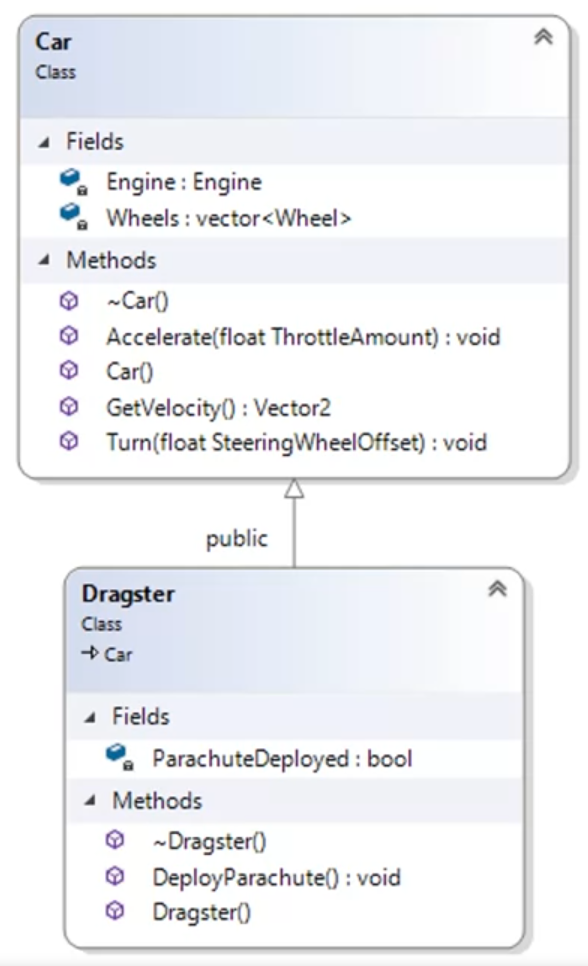
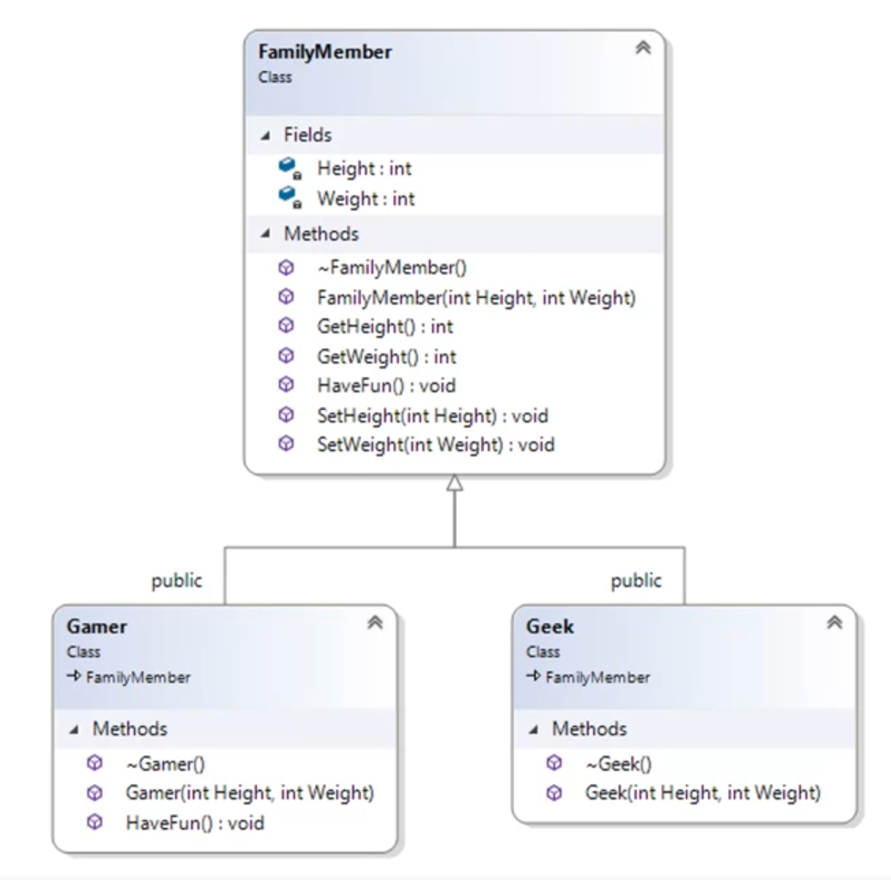
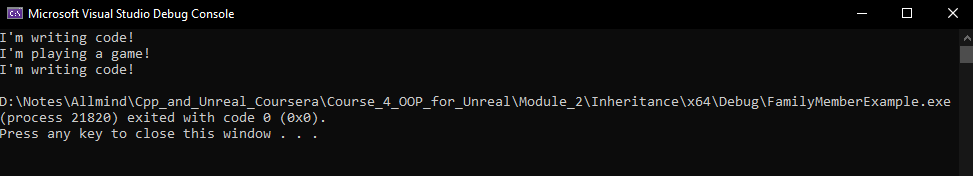

# Module 2. Inheritance and Polymorphism.

Inheritance is a way to structure code so multiple classes can share standard fields and methods if they are similar. For instance:
We have the parent class, "Car", which describes a car; we can build on this class with another class, the "Dragster", with a small addition. So, class Dragster will have some specific methods and fields, but our code will become clear. Here is the example in UML:



Let's look at another example of Inheritance in case of "Family members" classes. here is the description in UML diagram:



In this case we have a parent class `Family member` and 2 children: `Gamer` and `Geek`. [Here](/Course_4_OOP_for_Unreal/Module_2/Inheritance/FamilyMemberExample/FamilyMember.h) is code if header file of `Family member` class:
```C++
// Copyright A.T. Chamillard. All Rights Reserved.

#pragma once

/**
 * A family member
*/
class FamilyMember{
private:
	int Height;
	int Weight;
public:
	/**
	 * Constructor
	 * @param Height height of family member
	 * @param Weight weight of family member
	*/
	FamilyMember(int Height, int Weight);
	/**
	 * Destructor
	*/
	virtual ~FamilyMember();
	/**
	 * Gets the height of family member
	 * @return height of family member
	*/
	int GetHeight();
	/**
	 * Sets the height of family member
	 * @param Height height of family member 
	*/
	void SetHeight(int Height);
	/**
	 * Gets the weight of family member
	 * @return weight of family member
	*/
	int GetWeight();
	/**
	 * Sets the weight of family member
	 * @param Weight weight of family member
	*/
	void SetWeight(int Weight);
	/**
	 * Makes the family member have fun
	*/
	virtual void HaveFun();
};
```

Special word `virtual` means that children (sub-classes) of this class can `override`(replace) this method or (de)constructor with custom behavior. Yup, we can you the same name of methods in children to make the code clear. By the way it connected to Polymorphism, and we are going to talk about it later.
[Here](/Course_4_OOP_for_Unreal/Module_2/Inheritance/FamilyMemberExample/FamilyMember.cpp) is the implementation file of the class:
```C++
#include <iostream>
#include "FamilyMember.h"
/**
 * Constructor
 * @param Height height of family member
 * @param Weight weight of family member
*/
FamilyMember::FamilyMember(int Height, int Weight) :
	Height{ Height }, Weight{ Weight }
{
}
/**
 * Destructor
*/
FamilyMember::~FamilyMember(){

}
/**
 * Gets the height of family member
 * @return height of family member
*/
int FamilyMember::GetHeight(){
	return Height;
}
/**
 * Sets the height of family member
 * @param Height height of family member
*/
void FamilyMember::SetHeight(int Height){
	this->Height = Height;
}
/**
 * Gets the weight of family member
 * @return weight of family member
*/
int FamilyMember::GetWeight(){
	return Weight;
}
/**
 * Sets the weight of family member
 * @param Weight weight of family member
*/
void FamilyMember::SetWeight(int Weight){
	this->Weight = Weight;
}
/**
 * Makes the family member have fun
*/
void FamilyMember::HaveFun(){
	std::cout << "I'm writing code!\n";
}
```

Now, [let's look](/Course_4_OOP_for_Unreal/Module_2/Inheritance/FamilyMemberExample/Gamer.h) at the `Gamer` class:
```C++
#pragma once
#include "FamilyMember.h"
/**
 * A gamer
*/
class Gamer : public FamilyMember{
public:
	/**
	 * Constructor
	 * @param Height height of gamer
	 * @param Weight weight of gamer
	*/
	Gamer(int Height, int Weight);
	/**
	 * Destructor
	*/
	virtual ~Gamer();
	/**
	 * Makes the gamer have fun
	*/
	virtual void HaveFun() override;
};
```
We include the `"FamilyMember.h"` file to inheriting the parent class:
```C++
#include "FamilyMember.h"
```
Then say, that FamilyMember is parent class:
```C++
class Gamer : public FamilyMember
```
Specifically, this part says familymember is my parent class and this base class access specifier controls out access to the protected and private member variables and methods of our parent class. If we use public for our base class, then everything stays the way it was in our base class. Public member variables and functions stay public, protected member variables and functions stay protected, and private member variables and functions and stay private. If we put protected here, then public member variables and functions in our base class become protected and protected member variables and functions stay protected, and finally, if we put private here, public and protected member variables and functions become private instead.

Here we're overriding HaveFun. We say we're overriding HaveFun by including the override keyword:
```C++
virtual void HaveFun() override;
```
This function is still a virtual function because the function in the base-class is a virtual function. You can mark it as virtual as well if you want to be particularly clear about the fact that it stays a virtual function. This is a matter of taste. Seeing the word override already tells you it's a virtual function. Understanding how C++ works would tell you that this will be virtual as well. If you want to just be really explicit about it, you can just put the virtual keyword there as well. Whether or not we mark this function with the virtual keyword, if we were to derive another class from gamer, that other class could also override the HaveFun function.

Let's [move to](/Course_4_OOP_for_Unreal/Module_2/Inheritance/FamilyMemberExample/Gamer.cpp) `Gamer` implementation file:
```C++
#include <iostream>
#include "Gamer.h"
/**
 * Constructor
 * @param Height height of gamer
 * @param Weight weight of gamer
*/
Gamer::Gamer(int Height, int Weight) : 	FamilyMember(Height, Weight)
{
}
/**
 * Destructor
*/
Gamer::~Gamer(){
}
/**
 * Makes the gamer have fun
*/
void Gamer::HaveFun(){
	std::cout << "I'm playing a game!\n";
}
```
There our constructor is calling the `FamilyMember` constructor, parent class:
```C++
Gamer::Gamer(int Height, int Weight) : 	FamilyMember(Height, Weight)
{
}
```
And here we `override` the method from our parent class:
```C++
void Gamer::HaveFun(){
	std::cout << "I'm playing a game!\n";
}
```
**Notice**, we don't put virtual here in our implementation and we don't put override in our implementation. Those go in the header file, not here in our implementation file. 

The `Geek` header [file](/Course_4_OOP_for_Unreal/Module_2/Inheritance/FamilyMemberExample/Geek.h):
```C++
#pragma once
#include "FamilyMember.h"
/**
 * A geek
*/
class Geek : public FamilyMember{
public:
	/**
	 * Constructor
	 * @param Height height of geek
	 * @param Weight weight of geek
	*/
	Geek(int Height, int Weight);
	/**
	 * Destructor 
	*/
	virtual ~Geek();
};
```
And `Geek` implementation [file](/Course_4_OOP_for_Unreal/Module_2/Inheritance/FamilyMemberExample/Geek.cpp):
```C++
#include "Geek.h"
/**
 * Constructor
 * @param Height height of geek
 * @param Weight weight of geek
*/
Geek::Geek(int Height, int Weight) :
	FamilyMember(Height, Weight)
{
}
/**
 * Destructor
*/
Geek::~Geek(){
}
```
And how it works?
Here is script of calling all this classes and print some info:
```C++
#include <iostream>
#include "FamilyMember.h"
#include "Gamer.h"
#include "Geek.h"
/**
 * Family and Inheritance lecture code
 * @return exit status
*/
int main(){
    // construct family members
    FamilyMember TheFamilyMember{ 69, 185 };
    Gamer TheGamer{ 70, 200 };
    Geek TheGeek{ 71, 165 };
    // everybody has fun
    TheFamilyMember.HaveFun();
    TheGamer.HaveFun();
    TheGeek.HaveFun();
}
```
The output of this program:



When I run my code, you can see that our base-class or our parent class, the top of the class hierarchy, The `FamilyMember`, says, `I'm writing code!` The `Gamer`, remember, override the `HaveFun` method, so the gamer object prints, `I'm playing a game!`. Finally, the `Geek` object, which didn't override the `HaveFun()` method, just inherits that method from the parent class. When we call HaveFun on a geek object, it doesn't have an override of that method, so it goes and finds the method in the base-class sub-object and executes that method. That's why it says the same thing as the family member objects says when we tell the family member to have fun. 