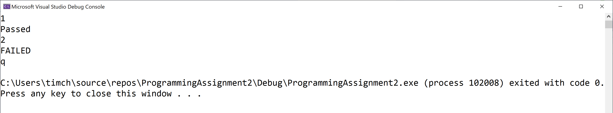

# Programming Assignment
## The Digitizer

### Assignment Description  

As you saw in the maps and event manager lectures, the C++ map (and Unreal TMap) container is a very useful container. I use maps all over the place in my games, so you should realize that maps are very common in the games we develop.

In this programming assignment, you'll implement a `Digitizer` console app class that provides useful functionality using a map.

### Why do we care?

Because maps are so common in game development, getting some practice using them will help you improve your game development skills.


### Getting Started

[Here](/Course_4_OOP_for_Unreal/Module_3/6_The_Digitizer/Source/ProgrammingAssignment2.sln) is source of Visual Studio project for this task (*.sln)

### Requirements

For this assignment, you need to implement a `Digitizer` class. The project I provided to you stubs for the `.h` and `.cpp` files for the `Digitizer` class as well as an implementation file with a main function (and supporting functions) that tests the `Digitizer` class. All of your work in this assignment is in the `Digitizer`  `.h` and `.cpp` files.

The big idea is that we can use the `Digitizer` class to convert from strings for digit names (like zero, one, etc.) to the actual numeric digit (like 0, 1, etc.). This is a great problem for a map, so that's how you should solve the problem.

You'll need to add code to declare and create an object for your map field, add code to the constructor to populate the map with the mappings between the strings for digit names and the corresponding numeric digits (zero through nine, inclusive), and add code to the `ConvertWordToDigit` function to return the corresponding numeric digit for valid strings for digit names or -1 for invalid
digit names (like bob).

Your code should handle mixed case strings properly, so the `ConvertWordToDigit` function should return 1 for strings one, One, oNe, onE, ONe, oNE, and ONE.

### Helpful Hint

When meeting that last requirement, do NOT use `std::transform`, which works fine in Visual Studio and Xcode but doesn't work in g++ in the autograder. Instead, you should use a for loop to convert each character in the string to lower or upper case (depending on what you used for keys in your map).

### Required Output Format

The tester implementation file I provided handles all the output correctly. It simply prints Passed or FAILED for each test case that's selected by the user input.

### Running Your Code

Because of the code I included to work with the automated grader on Coursera, when you run your program the command prompt window will open and it will sit there doing nothing. To make your code run, type in a test case number (1 through 10, inclusive) and press the `<Enter>` key; your code should then run so you can check your output. 

For example, your input could be
`
3
`
to run the third test case.

You can actually run your code again if you want to by typing in a test case number and pressing the `<Enter>` key again. When you’re ready to stop running your code, type q (for quit).

Here's what running the code multiple times with different
Here's what running the code multiple times with different inputs should look like (though none of your test cases should fail!). The first line is the test case number, the second line is your output line, and so on:  
```
1
Passed
2
FAILED
q
```

The image below shows my console window when I run the code multiple times as described above:



### Solution
[Here](/Course_4_OOP_for_Unreal/Module_3/6_The_Digitizer/Solution/ProgrammingAssignment2.sln) is solution of Visual Studio project for this task (*.sln)