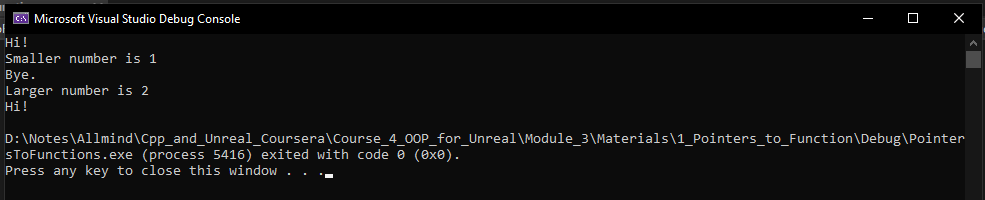
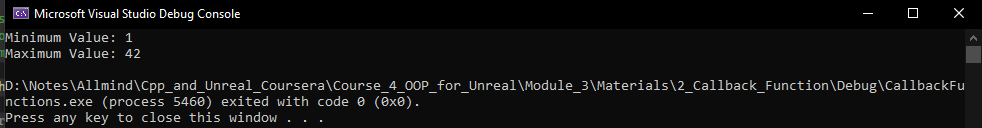

# Module 3
## Pointer to function
We know from our past work that we can use pointers to point to data variables in memory and functions are also stored in memory. The executable code is also stored in memory. We can also use pointers to point to the memory address of the executable code.
[Example](/Course_4_OOP_for_Unreal/Module_3/Materials/1_Pointers_to_Function/PointersToFunctions/PointersToFunctions.cpp) of pointers to function:


```C++
#include <iostream>
void SayHi();
void SayBye();
int FindSmaller(int FirstNumber, int SecondNumber);
int FindLarger(int FirstNumber, int SecondNumber);
/**
 * Pointers to Functions lecture code
 * @return exit status
*/
int main()
{
	// declare pointers to functions
	void (*SayFunction)() { nullptr };
	int (*FindFunction)(int, int) { nullptr };

	// won't compile
	//SayFunction = FindSmaller;

	// assign variables and execute functions
	SayFunction = &SayHi;
	SayFunction();
	FindFunction = &FindSmaller;
	std::cout << "Smaller number is " <<
		FindFunction(1, 2) << '\n';

	// reassign variables and execute functions
	SayFunction = &SayBye;
	SayFunction();
	FindFunction = &FindLarger;
	std::cout << "Larger number is " <<
		FindFunction(1, 2) << '\n';

	// we can also omit the address of operator
	SayFunction = SayHi;
	SayFunction();
}

void SayHi() { std::cout << "Hi!\n"; }
void SayBye(){ std::cout << "Bye.\n";}
int FindSmaller(int FirstNumber, int SecondNumber){
	if (FirstNumber <= SecondNumber){
		return FirstNumber;
	}
	else{
		return SecondNumber;
	}
}
int FindLarger(int FirstNumber, int SecondNumber){
	if (FirstNumber >= SecondNumber){
		return FirstNumber;
	}
	else{
		return SecondNumber;
	}
}
```
The output of the code above is:



We can pass in a pointer to a function as an argument to a different function. Later on, that different function can call back the function that we passed it. The pointer to function that we pass in is called the **callback function**, and the function that does the calling back is called a **higher-order function**. 
[Example](/Course_4_OOP_for_Unreal/Module_3/Materials/2_Callback_Function/CallbackFunctions/CallbackFunctions.cpp) of callback function implementation:

```C++
#include <iostream>
#include <vector>
bool LessThan(int FirstNumber, int SecondNumber);
bool GreaterThan(int FirstNumber, int SecondNumber);
int FindExtreme(std::vector<int>& Values, bool (*Compare)(int, int));
/**
 * Callback Functions lecture code
 * @return exit status
*/
int main()
{
    std::vector<int> Values{ 2, 7, 3, 42, 1, 7, 2 };
    // find and print minimum value
    int MinValue = FindExtreme(Values, &LessThan);
    std::cout << "Minimum Value: " << MinValue << '\n';
    // find and print maximum value
    int MaxValue = FindExtreme(Values, &GreaterThan);
    std::cout << "Maximum Value: " << MaxValue << '\n';
}
/**
 * Returns true if the first number is less than
 * the second number, false otherwise
 * @param FirstNumber first number
 * @param SecondNumber second number
 * @return comparison result
*/
bool LessThan(int FirstNumber, int SecondNumber) {return FirstNumber < SecondNumber; }
/**
 * Returns true if the first number is greater than
 * the second number, false otherwise
 * @param FirstNumber first number
 * @param SecondNumber second number
 * @return comparison result
*/
bool GreaterThan(int FirstNumber, int SecondNumber){return FirstNumber > SecondNumber;}
/**
 * Finds an extreme value in the list of values based
 * on the Compare function
 * @param Values list of values
 * @param Compare function to use to compare two values
 * @return extreme value
*/
int FindExtreme(std::vector<int>& Values, bool (*Compare)(int, int)){
    // assume at least one value is provided
    int ExtremeValue = Values[0];
    // look through rest of values for extreme value
    for (size_t i{ 1 }; i < Values.size(); i++){
        if (Compare(Values[i], ExtremeValue)){
            ExtremeValue = Values[i];
        }
    }
    return ExtremeValue;
}
```
The output of script:


## Tasks
- [Exercise. Practice with Callback Functions](/Course_4_OOP_for_Unreal/Module_3/1_Callback_Func/Callback_Func.md)
- [Exercise. Who You Gonna Call?](/Course_4_OOP_for_Unreal/Module_3/2_Who_You_Gonna_Call/Who_You_Gonna_Call.md)
- [Exercise. Refactoring Fish Shooter](/Course_4_OOP_for_Unreal/Module_3/3_Refactoring_Fish_Shooter/Refactoring_Fish_Shooter.md)
- [Exercise. Don't Destroy Me](/Course_4_OOP_for_Unreal/Module_3/4_Dont_Destroy_Me/Dont_Destroy_Me.md)
- [Exercise. Fish Shooter Menu System](/Course_4_OOP_for_Unreal/Module_3/5_Fish_Shooter_Menu_System/Fish_Shooter_Menu_System.md)
- [Programming Assignment. The Digitizer](/Course_4_OOP_for_Unreal/Module_3/6_The_Digitizer/The_Digitizer.md)